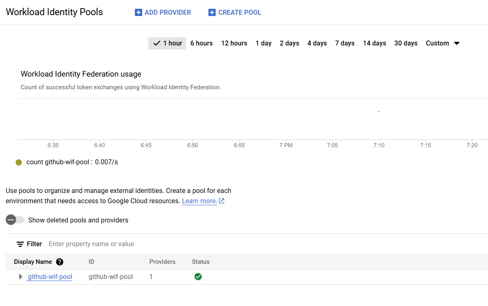

# github-actions-oidc-gcp

# Create Identity pool
    gcloud iam workload-identity-pools create github-wif-pool --location="global" --project my-first-gcp-instance-54125
        "github-wif-pool"                    -------> Name of the Pool
        "my-first-gcp-instance-54125"       -------> Project_id

# Create Workload identity provider
    gcloud iam workload-identity-pools providers create-oidc githubwif --location="global" --workload-identity-pool="github-wif-pool" --issuer-uri="https://token.actions.githubusercontent.com" --attribute-mapping="attribute.actor=assertion.actor,google.subject=assertion.sub,attribute.repository=assertion.repository" --project my-first-gcp-instance-54125
            
            "githubwif"                    -----> Identity name provider
            "my-first-gcp-instance-54125" ------> Project_id

            # Keep Remaining all as default

# Create SA
    gcloud iam service-accounts create test-wif --display-name="Service account used by WIF" --project  my-first-gcp-instance-54125
            "test-wif"                        -----> service account name    
            "my-first-gcp-instance-54125"   -------> Project_id

# Add permissions to SA form console
    tokencreater
    compute admin
    or as per your requirements

# Add permission to WIF SA
    principalSet://iam.googleapis.com/projects/10200573752487/locations/global/workloadIdentityPools/github-wif-pool/attribute.repository/kiran-113/github-actions-oidc-gcp

          "10200573752487"     --------> Project Number 
          "github-wif-pool"   --------> Pool Name
          "kiran-113/github-actions-oidc-gcp"   ---- > repository

          give "workloadIdentityUser" for above 

projects/10200573752487/locations/global/workloadIdentityPools/github-wif-pool/providers/githubwif
    "10200573752487"    is  project_number
    "github-wif-pool"  is  pool_id
    "githubwif"        is  provider_id   Replace them as per your requirements

